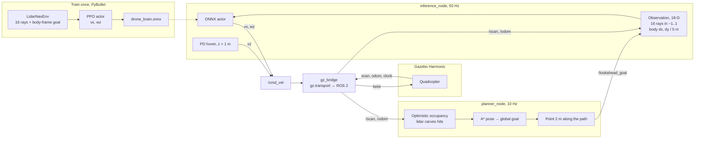

# Obstacle avoidance for a simulated quadcopter

A PPO policy trained in PyBullet flies a Gazebo quadcopter. The actor is exported to ONNX and runs at 50 Hz in a ROS 2 node. A live occupancy A* co-pilot feeds it a short lookahead goal; the policy still owns `/cmd_vel`.

## Current policy

The shipped policy navigating the obstacle course. It uses the normalized lidar fan and a body-frame target.

https://github.com/user-attachments/assets/77fc9265-f9ee-4947-a3c5-5429bd29102e

## Training history

These clips are from learning, not the system above.

Early on, climbing over the obstacles scored better than flying around them. The reward was then changed to penalize extra altitude.

https://github.com/user-attachments/assets/409bbe1c-4240-46f6-a09b-615f3da7009a

A dynamics mismatch between PyBullet and Gazebo, plus early exploration, produced crashes like this flip into an obstacle.

https://github.com/user-attachments/assets/ca36664e-2089-4b33-8730-c3826997bb49

## Architecture

The PPO actor is the only thing that publishes `/cmd_vel`. A* never commands the drone. It only moves the goal the actor sees, so a local 5 m policy can follow a path around walls.



**What each piece owns**

| Piece | Input | Output |
|---|---|---|
| `gz_bridge` | Gazebo scan, odom, clock, and ROS `/cmd_vel` | ROS `/scan`, `/odom`, `/clock`, and a Gazebo twist |
| `planner_node` | `/scan`, `/odom`, fixed global goal | `/lookahead_goal` — a pose 2 m ahead on the A* path |
| `inference_node` | `/scan`, `/odom`, `/lookahead_goal` | `/cmd_vel`: actor `vx` and `wz`, PD `vz` |

**How A* helps.** The actor was trained on a 180° forward fan clipped at 5 m plus a nearby body-frame goal. That is enough to dodge what it can see, and not enough to route through a warehouse or a long corridor. At runtime the planner starts from an empty (free) grid, carves occupied cells from each scan, and runs 8-connected A* from the current pose to the global goal. The point 2 m along that path replaces the distant waypoint inside the 18-D observation, in the same frame the policy saw in PyBullet. The actor still picks speed and yaw rate. If `/lookahead_goal` is older than 1 s, the node falls back to the waypoint itself. Altitude is outside the policy: a PD loop holds 1 m.

## Run it

ROS 2 Humble, Gazebo Harmonic (`gz-sim8`), and Python 3.10.

```bash
pip install 'onnxruntime>=1.17'
cd ~/drone_ws && colcon build --packages-select drone_robot
source install/setup.bash

ros2 launch drone_robot ros2launch.py
ros2 launch drone_robot ros2launch.py world:=warehouse spawn_x:=-5.0
ros2 launch drone_robot ros2launch.py use_rviz:=true
```

`onnxruntime` has no rosdep key on Humble, so it is installed with pip. The first launch starts the explore world. `world:=warehouse` needs a spawn at x = −5. `use_rviz:=true` draws the global path and the lookahead marker.

Worlds: `explore` (default), `warehouse`, `factory`, `forest`, `eval_1` through `eval_5`.

Training is a separate PyBullet venv. Do not source ROS in that shell. See [train/README.md](train/README.md).

## Limits

This flies in simulation only. The occupancy grid starts empty, and a cell stays free until a lidar ray hits it, so A* can plan through a wall it has not seen yet. The network does not command altitude. A PD loop holds 1 m, which is why an early policy could clear the course by climbing and why the reward had to penalize height.

## Bridge

Humble `ros_gz_bridge` cannot talk to gz-sim8 on this machine, so `gz_bridge_node.py` speaks gz.transport directly and republishes `/scan`, `/odom`, and `/clock`.
